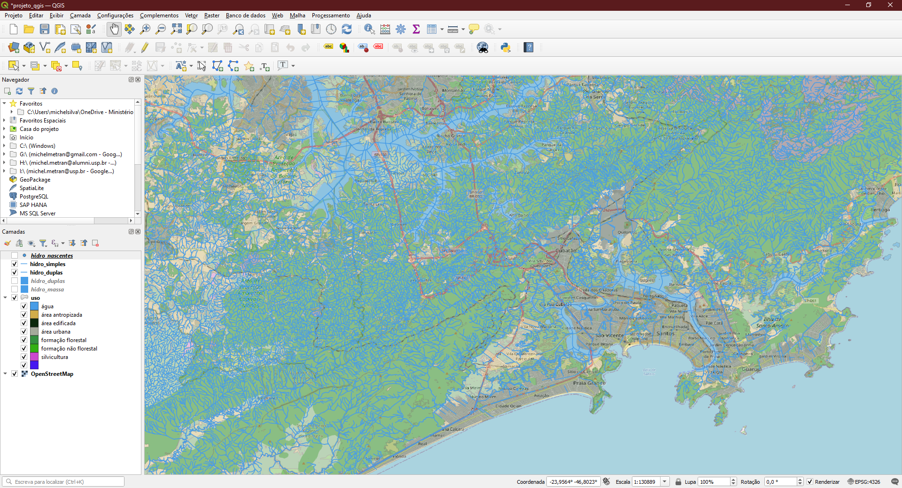

 

Em novembro de 2022 surgiu a necessidade/curiosidade de melhor compreender os dados de hidrologia e uso do solo disponibilizados pela [Fundação Brasileira para o Desenvolvimento Sustentável (FBDS)](https://www.fbds.org.br). Os dados são utilizados em projetos de pesquisa (Biota-Síntese e outros) e são disponibilizados em um [**repositório público de mapas e _shapefiles_ para _download_**](https://geo.fbds.org.br/).

Para obter os dados desenvolvi _scripts_ para fazer o _download_ dos _layers_ do estado de São Paulo. As rotinas podem ser usadas para outros estados. O resultado formou a criação de 7 _layers_ em formato _geopackage_:

| id  | _Layer_              | Subpasta    | Tamanho |
| :-- | :------------------- | :---------- | ------: |
| 1   | app.gpkg             | APP         |  994 MB |
| 2   | app_uso.gpkg         | APP         | 2,07 GB |
| 3   | hidro_simples.gpkg   | HIDROGRAFIA |  673 MB |
| 4   | hidro_duplas.gpkg    | HIDROGRAFIA | 93,8 MB |
| 5   | hidro_nascentes.gpkg | HIDROGRAFIA | 60,0 MB |
| 6   | hidro_massa.gpkg     | HIDROGRAFIA |  124 MB |
| 7   | uso.gpkg             | USO         | 3,89 GB |
|     | Total                |             | 7,87 GB |

 

Abaixo segue informações obtidas no _site_ da Fundação:

> Em 2015 a [Fundação Brasileira para o Desenvolvimento Sustentável](https://www.fbds.org.br) deu início ao Projeto de Mapeamento em Alta Resolução dos Biomas Brasileiros, que desde então vem produzindo dados primários de uso e cobertura do solo, hidrografia e Áreas de Preservação Permanente em uma resolução inédita para os biomas brasileiros (5 metros).
>
> Os resultados do mapeamento vêm sendo utilizados para apoiar a execução de políticas públicas - em especial a implementação do Cadastro Ambiental Rural, o planejamento territorial, a realização de pesquisas acadêmicas e o desenvolvimento de tecnologias. Até o momento o mapeamento já foi concluído para mais de 4 mil municípios brasileiros abrangidos pelos biomas Mata Atlântica e Cerrado.

 

 

---

## _TODO_

1. ~~Definir funções de fazer o _download_ dos arquivos, a partir da lista.~~
2. ~~Realizar o agendamento para obter a lista.~~
3. ~~Ajustar a pasta de _download_. Atualmente vai para a pasta padrão. Movi manualmente!~~
4. Ajustar os tipos de arquivos (Pontos, Polylines, Polygons), visto que na lista de arquivos surgiu uma feição curiosa:
   1. _RIOS_DUPLOS.shp_
   2. _RIOS*DUPLOS*.shp_
   3. _RIOS_DUPLOS_POL.shp_
